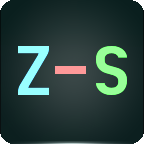  

# Z-S Overview Pack
### Overview Pack for EVE Online

The Z-S Overview was created to provide a generalized, user-friendly, 6-Tab Overview, ready to use as-is with room to be tailored as needed.

What started as a stop-gap measure back in early 2016 to bring the SaraShawa Overview up-to-date for 118.6, snowballed into a complete re-write of the .YAML file and total overhaul of the visuals in July 2016 for the first installment.

If you're familiar with SaraShawa, it shouldn't take too long to adjust to the changes.

**Zirio** - YAML Coding & Pack Maintenence  
**Deuce Syundai** - Design & Text Formatting

##### New features include:

- Choice of Full-Size or Compact 6-Tab Layouts that can be swapped at any time without reloading the entire pack.
- Modular Setup: Load the Preset Packs you need.
- New and ever evolving presets for all activities on EVE, including dedicated Faction Warfare and Incursion presets among others.
- Color-coded presets by category for improved ease of selection.

#### Current Version: v5.11.0424

- Updated: **2017.01.01**
- For Release: **118.10**
- Compatible: **119.3**

#### Links

- In-game Mailing List: **Z-S Overview**
- Visit us on: **[Slack](https://tweetfleet.slack.com/messages/zs-overview-dev/) - [Twitter](https://twitter.com/Arziel1992) - [Discord](http://discord.gg/NSfFKcx)**
- Changelog: **[Here](https://github.com/Arziel1992/Z-S-Overview-Pack/blob/master/CHANGELOG.md)**
- FAQ: **[Here](https://github.com/Arziel1992/Z-S-Overview-Pack/blob/master/FAQ.md)**
- Feedback: **[Here](http://goo.gl/forms/h4rTeZCHNorqEsyx2)**
- Donors: **[Here](https://github.com/Arziel1992/Z-S-Overview-Pack/blob/master/DONORS.md)**
- Milestones: **[Here](https://github.com/Arziel1992/Z-S-Overview-Pack/blob/master/MILESTONES.md)**

## How to install
#### Must Read!

- Be sure to have a quick read of **[EVE University's Overview guide](http://wiki.eveuniversity.org/Overview)**, either to learn how everything works or have a reminder.

- We expect the **player to have a minimal understanding on how the Overview System works** before attempting to install Z-S and/or any other 3rd party Overview Pack.

- Be sure to check our **[FAQ](https://github.com/Arziel1992/Z-S-Overview-Pack/blob/master/FAQ.md)** to solve the most common issues you might find when attempting to install and/or edit Z-S Overview Pack.

#### Method 1: Video Tutorials

- Follow this in-depth **[Video Tutorial](https://www.youtube.com/watch?v=lTmXDiEgb7s)** kindly made by **ERJ145a** - [English]

- **OR** Follow this **[Quick Spotlight](https://www.youtube.com/watch?v=pJApc_E66Es)** kindly made by **AHandinit Flo** - [English]

- **OR** Follow this **[Quick Spotlight](https://www.youtube.com/watch?v=3TdCvC38qI0)** kindly made by **Grie** - [Czech]

#### Method 2: In-game, from `Z-S Overview` chat channel

1. Open up your Overview Settings ( ≡ button at top left of the Overview window).  
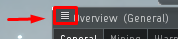

2. Go to the "Misc" tab and click `Reset All Overview Settings`  
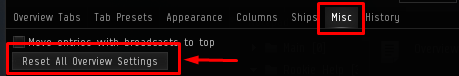  
    - You **MUST** do this the first time you install.
    - This prevents any weirdness that may be caused by any changes already made to the overview.

3. Apply the `Z-S Core` preset pack FIRST by clicking on its link.  
This is the only **required** preset pack.  
When combined with a Tab Layout, it includes the following presets for a minimal setup:
	- Core Presets  
    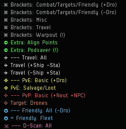  
	- All **Travel**, **Warpout** & **Brackets** presets
	- **PvE: Basic** & **PvE: Salvage/Loot**
	- **PvP: Basic** & **Target: Drones**
	- **Friendly: All** & **Friendly Fleet**
	- **D-Scan: All**

4. (Optional) Apply any of the following Optional preset packs by clicking on their links.  
You may need them for more specialized presets:
	- `Z-S PvE Extended` contains presets for Anoms/Ratting, Incursion, Mining, and Show Drones.
	- `Z-S PvP Basic` contains presets for Faction Warfare, Ships Only, Bombing Warpouts, Deployables, NPSI, Structures, and Wartargets.
	- `Z-S PvP Extended` packs include Target presets for specific categories, from Fighters to Frigates to Logi to Titans. Each pack contains half the categories and should be installed together.
	- `Z-S Friendly Extended` includes presets for Capitals, Supercapitals, Carriers, Dictors, Dreads, Logi, and Recon.
	- `Z-S D-Scan Extended` contains more finely-tuned presets specifically for the D-Scan filter.
	- _You can go back to add in additional packs at any time without reloading the entire pack. Simply click on a pack to add, then repeat step 5 below._
	- Note the instructions on the tab.  
    
    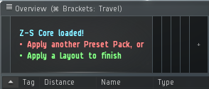  
    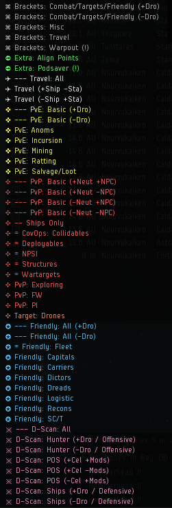  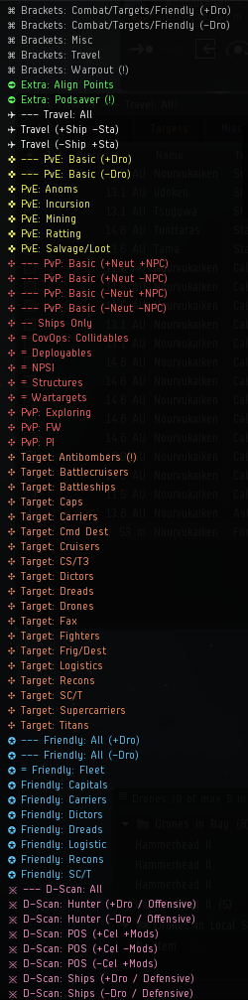  

5. To finish and set up the tabs, apply a Tab Layout by clicking on their links.  
Standard has each tab named for a purpose, and Compact replaces most of the names with numbers or shorter names for reduced tab width.  
2BL denotes 2 Bracket Lines, while 1BL denotes 1 Bracket Line.
 - `Standard` tab layout  
 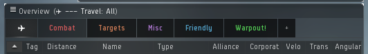  
 - `Compact` tab layout  
 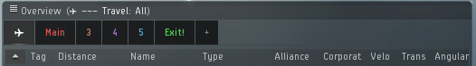  
 - `1BL` Brackets  
 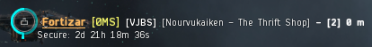 
 - `2BL` Brackets  
 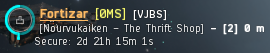   
	- You can alternate between Layouts at any time without reloading the entire pack by clicking on their links.
	- _Some features might not show correctly at first, it may be necessary to open the Overview Settings again, then select the Ships tab to reload the UI to force a resync and apply all changes._

#### Method 3: Out of game

1. Download:
    1. Full project:
        - Click the green "Clone or download" button located at the top right of the above file list, then click `Download ZIP`
        - It will download a complete copy of the project (not recommended).
    2. Specific release (version):
        - Click the "Releases" link near the "Clone or Download" button.
        - Go to the release you are interested in (latest release is recommneded).
        - Scroll down to `Downloads` of said release and download the `Z-S-...-.zip` file.

2. Once downloaded in the folder of your preference, extract the .zip file contents in a folder of your preference.

3. Go to the most recent version folder and:
    - Copy the `Z-S Full Stylized.yaml` file for the complete pre-stylized overview.
    - Or copy the `Z-S Full Unstylized.yaml` file for the complete default-style overview.
    - Or copy the specific packs you want/need, alongside one or all layouts.

4. Go to `C:\Users\YourName\Documents\EVE\Overview` folder and paste the copied files there.
    - If the folder doesn't exist, you can either create it manually.
    - Or export your current overview (recommended) and it will be created automatically.
        - To export, follow step 5-6.
        - Instead of import, choose export and mark `Check All`
        - This will save your current overview and its settings.

5. Start the game and open up your Overview Settings ( ≡ button at top left of the Overview window).

6. Go to the `Misc` tab:
    - Click `Reset All` to have the default settings loaded.
    - Follow steps 5-6 and click `Import Overview Settings`

7. Select one of the copied files on the left list, click `Check All` on the top middle of the window, then click `Import`

8. Repeat step 7 if you are importing individual packs + layouts instead of a Full profile.
	- _Some features might not show correctly at first, It may be necessary to Dock and then Undock at any station to reload the UI to apply all changes._

#### Packs, Layouts & Presets

- Z-S Core

        ➲ Extra: Align Points
        ✈ --- Travel: All
        ✈ Travel (+Ship -Sta)
        ✜ --- PvE: Basic (-Dro)
        ✪ = Friendly: Fleet
        ※ --- D-Scan: All

- Z-S D-Scan Extended

        ※ D-Scan: Hunter (+Dro / Offensive)
        ※ D-Scan: Hunter (-Dro / Offensive)
        ※ D-Scan: POS (+Cel +Mod)
        ※ D-Scan: POS (+Cel -Mod)
        ※ D-Scan: POS (-Cel +Mod)
        ※ D-Scan: Ships (+Dro / Defensive)
        ※ D-Scan: Ships (-Dro / Defensive)

- Z-S Friendly Extended

        ✪ --- Friendly: All (+Dro)
        ✪ Friendly: Capitals
        ✪ Friendly: Carriers
        ✪ Friendly: Dictors
        ✪ Friendly: Dreads
        ✪ Friendly: Logistics
        ✪ Friendly: Recons
        ✪ Friendly: SC/T

- Z-S PvE Extended

        ✜ --- PvE: Basic (+Dro)
        ✜ --- PvE: Mission Filter (+LCO +LCS)
        ✜ PvE: Anoms
        ✜ PvE: Incursion
        ✜ PvE: Mining
        ✜ PvE: Ratting

- Z-S PvP Basic

        ✥ --- PvP: Basic (+Neut -NPC)
        ✥ --- PvP: Basic (-Neut +NPC)
        ✥ --- PvP: Basic (-Neut -NPC)
        ✥ -- Ships only
        ✥ = CovOps: Collidables
        ✥ = Deployables
        ✥ = NPSI
        ✥ = Structures
        ✥ = Wartargets
        ✥ PvP: Exploring
        ✥ PvP: FW
        ✥ PvP: PI

- Z-S PvP Extended (1/2)

        ✥ Target: Antibombers (!)
        ✥ Target: Battlecruisers
        ✥ Target: Battleships
        ✥ Target: Caps
        ✥ Target: Carriers
        ✥ Target: Cmd Dest
        ✥ Target: Cruisers
        ✥ Target: CS/T3
        ✥ Target: Dictors
        ✥ Target: Dreads

- Z-S PvP Extended (2/2)

        ✥ Target: Fax
        ✥ Target: Fighters
        ✥ Target: Frig/Dest
        ✥ Target: Logistics
        ✥ Target: Recons
        ✥ Target: SC/T
        ✥ Target: Supercarriers
        ✥ Target: Titans

- All 4 Layouts (Standard 2BL & 1BL, Compact 2BL & 1BL)

        ⌘ Brackets: Combat/Targets/Friendly (+Dro)
        ⌘ Brackets: Combat/Targets/Friendly (-Dro)
        ⌘ Brackets: Misc
        ⌘ Brackets: Travel
        ⌘ Brackets: Warpout (!)
        ✈ Travel (-Ship +Sta)
        ✥ --- PvP: Basic (+Neut +NPC)
        ✥ Target: Drones
        ✜ PvE: Salvage/Loot
        ✪ --- Friendly: All (-Dro)
        ➲ Extra: Podsaver (!)

#### Nomenclature

    - Cel:  Celestial(s)
    - Dro:  Drone(s) & Fighter(s)
    - Neut: Neutral(s)
    - NPC:  Rat(s) - Non-Player Character(s)
    - Mod:  Module(s)
    - Sta:  Station(s) & Citadel(s)
    - Offensive:    
    - Defensive:    

#### Pack colors

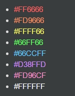

## Popular mods
Since we can't possibly please everyone with a perfect overview solution, players have taken upon themselves to make very useful modifications to the pack.

Be sure to check them out!

- **[Z-S-Overview-Kafferton-Mod](https://github.com/ChemicalRascal/Z-S-Overview-Kafferton-Mod)** made by **Sally Kafferton**

## Important!
##### If you clone and/or fork the repository!

- Starting from Version v2.66.2012, versioning has been standardized (more information on the **[Changelog](https://github.com/Arziel1992/Z-S-Overview-Pack/blob/master/CHANGELOG.md)** file)  
    - The inclusion of version tags and consistant numbering has been implemented, will allow to keep a better track of the modifications.  
- If you plan to clone and/or fork the repository, it is recommended to do it from this version forward.  
- Commit Squashing WILL NOT be done randomly from now on, so don't worry about an inconsistent history.  
    - If a Commit Squash happens, we will notify all the cloners/forkers with anticipation.  
    - Please send an in-game mail to `Zirio` notifying him that you are a cloner/forker so he can notify you back in case of a Commit Squash.  

## License

Overview Pack licensed under "GNU GENERAL PUBLIC LICENSE - Version 3, 29 June 2007"  
Further documentation in the **[LICENSE](https://github.com/Arziel1992/Z-S-Overview-Pack/blob/master/LICENSE)** file.

## Notice

SaraShawa Overview Pack did not have a GitHub repository nor it was under any License at the moment of the manual fork and at the moment of creation of this repository.

## Copyright Notice

EVE Online and the EVE logo are the registered trademarks of CCP hf. All rights are reserved worldwide. All other trademarks are the property of their respective owners. EVE Online, the EVE logo, EVE and all associated logos and designs are the intellectual property of CCP hf. All artwork, screenshots, characters, vehicles, storylines, world facts or other recognizable features of the intellectual property relating to these trademarks are likewise the intellectual property of CCP hf. CCP hf. has granted permission to Z-S-Overview-Pack to use EVE Online and all associated logos and designs for promotional and information purposes on its website but does not endorse, and is not in any way affiliated with, Z-S-Overview-Pack. CCP is in no way responsible for the content on or functioning of this website, nor can it be liable for any damage arising from the use of this website.
